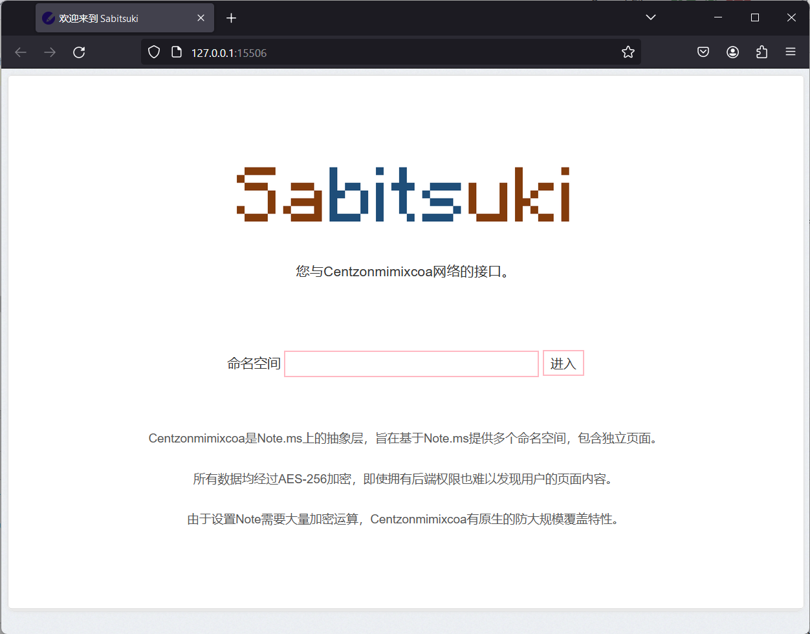

# Centzonmīmixcōa
加密在线笔记本

基于服务器零信任原则，加解密均在客户端完成。

可选用Note.ms或任何基于NotePaper的服务器。

### 准备环境
在项目根目录下
```commandline
py -m venv .venv
.venv\Scripts\activate
py -m pip install -r requirements.txt
```

### 打开 Centzonmimixcoa Shell
```commandline
py centzonmimixcoa.py
```

### 打开 Sabitsuki 用户界面
```commandline
py sabitsuki.py
```

## Centzonmimixcoa Shell
一个命令行界面，用于与Centzonmimixcoa网络交互。
```
Centzonmimixcoa v1.0 Interactive Shell

> changeme my_lovely_page          //一个空白页面
lugh_core: GET 2960fbee0ae3920bcd6744bf 

> changeme my_lovely_page aha!     //写入内容“aha！”
lugh_core: POST 2960fbee0ae3920bcd6744bf ALQrp5zsCAgdLPHtkW54TWlNAAMmU+QG9r9+9X6dedo=
Posted
> changeme my_lovely_page          //再次读取页面
lugh_core: GET 2960fbee0ae3920bcd6744bf ALQrp5zsCAgdLPHtkW54TWlNAAMmU+QG9r9+9X6dedo=
aha!
> 
```

## Sabitsuki
一个基于Flask的Web页面，提供与Note.ms相近的体验，使用Centzonmimixcoa网络获取和设置笔记。


## lugh_core
Centzonmimixcoa的操作库。
```python
from lugh_core import Lugh

l = Lugh(host="https://note.ms/", proxy="")
l.get_note("changeme","my_lovely_page")
l.post_note("changeme","my_lovely_page","aha!")
```

## 备注
* Centzonmimixcoa Shell与Sabitsuki的**配置文件**位于`%LOCALAPPDATA%\ect.fyi\ntms\`目录下（Windows）或`~/.local/share/ntms/`目录下（Linux）。可以手动修改这些文件来设置服务器主机名和代理。